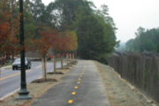
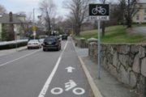
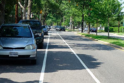
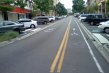
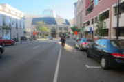
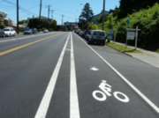
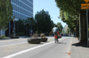
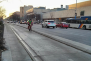
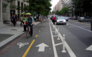
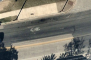

# Guide

## Main tags

For this exercise, we are focusing only on these tags:

|||||
|---|---|---|---|
|[cycleway](https://wiki.openstreetmap.org/wiki/Key:cycleway)<br />[highway](https://wiki.openstreetmap.org/wiki/Key:highway)|[lanes](https://wiki.openstreetmap.org/wiki/Key:lanes)<br />[oneway](https://wiki.openstreetmap.org/wiki/Key:oneway)|[maxspeed](https://wiki.openstreetmap.org/wiki/Key:maxspeed)<br /> [parking](https://wiki.openstreetmap.org/wiki/Key:parking:lane)|[surface](https://wiki.openstreetmap.org/wiki/Key:surface)|

## Bike facilities examples

|Photo|Denominations|Tags|Remarks|
|---|:---:|---|---|
||Trail<br />Sidepath|highway=cycleway<br/>surface=asphalt|Must be drawn as its own centerline.|
||Bike lane without parking|cycleway:{side}=lane<br/>parking:lane:{side}=no_parking<br/>||
||Bike lane with parking|cycleway:{side}=lane<br/>parking:lane:{side}=parallel<br/>||
||Contraflow bike lane|oneway=yes<br/>cycleway:{side}=opposite_lane<br/>|
||Bike + parking lane|cycleway:{side}=lane<br/>parking:lane:{side}=parallel<br/>|
||Buffered bike lane|cycleway:{side}=buffered_lane<br/>||
||One-way cycle track<br />One-way protected lane|cycleway:{side}=track|See also [cycle tracks alternative](#cycle-tracks-alternative)|
||Contraflow Cycle track|cycleway:{side}=opposite_track|
||Two-way cycle track<br />Two-way protected lane|highway=cycleway|Must be drawn as its own centerline.|
||Sharrows<br />Shared Lane|cycleway:{side}=shared_lane||

### Remarks

#### Cycle tracks alternative

Cycle tracks can alternatively be mapped as a separate centerline, in which case they should be tagged as:

```kvp
highway=cycleway
oneway=yes
```

## Frequently asked questions

### Which side of the road?

`left` and `right` are relative to the direction the line is drawn in OSM, which is indicated  by an arrow on the line,
not necessarily the direction of travel on the bike lane.

|General diagram| Representation in ID editor|
|:---:|:---:|
|||

In the facilty examples above, `{side}` can be either `left` or `right`. When it is both, the direction is  omitted.

Official documentation:
[Forward & backward, left & right](https://wiki.openstreetmap.org/wiki/Forward_%26_backward,_left_%26_right)

### How many lanes?

* The `lanes` tag represents the count of all car lanes on the the road, in both directions.
* Center turn lanes **must** be included in the number of lanes.
* Non-car lanes are omitted.

## Extra resources

* [City of Austin - OSM Mapathon Instructions](https://github.com/cityofaustin/atd-geospatial/wiki/OSM-Mapathon-Instructions)
* [Bicycle Network Analysis OpenStreetMap Tag Guidelines](https://docs.google.com/document/d/1isc9M9_c-QL4Oy8_MxAyogZ6ocs1F6PeEn_Y1p0WZp8/edit#heading=h.zfgapbgr6a6l)
* [Mapping with OpenStreetMap (MapBox Mapping guides)](https://labs.mapbox.com/mapping/)
