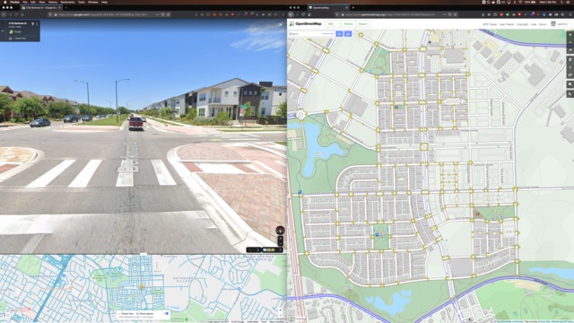
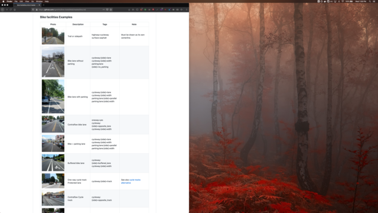
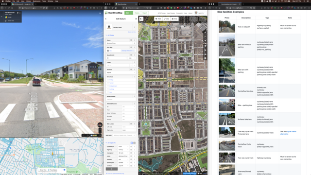

# Method

## Screen setup

To map efficiently, you will need 3 windows:

* Google Street view
* OSM ID editor
* This site

It makes things simpler to spread them over multiple screens.

### Two screens

This is by far the most common setup. Use 2 screens, either physical or virtual.

|First screen|Second screen|
|:---:|:---:|
|||

On the first screen, open 2 browser windows. Give 50% of the screen to each of them.

On the leftmost window, [open GoogleMaps with Street view](https://www.google.com/maps). Give the top 75% of the tab to
the actual street view, the rest at the bottom, to the map view.

On the rightmost window, [open OSM with the ID editor](https://www.openstreetmap.org/edit?editor=id#map=13/30.2883/-97.7042).

On the second screen, [open this website](https://rgreinho.github.io/bna-tools/). Use as must space as you feel
comfortable with. The goal is to find the tagging information quickly.

### One wide screen

An alternative setup that is used on wide screens (UHD, 4K, etc.) is to open the 3 windows on the same screen, and give
each of them 1/3 of the screen.

The screenshot bellow depicts this setup on a 4K monitor at a definition of 3840 x 2160 pixels.

## Mapping

This method consist in using Google Street view to identify the street features described by the main tags
[in our guide](../index.md), then report them to OSM using the ID editor.

The tasks can be performed at the same time or sequentially, as you prefer.

### Example: E. M. Franklin Ave. between E. 12th St and Manor Road

Place the street view orange man at E. 12th St & E. M. Franklin Ave. Look North.

Start identifying the street features represented by the tags at the top of our guide. We can see the following ones:

* There are 2 car lanes.
* There is a sign indicating a speed limit of 30mph.
* Cars are parked parralel to the road on both sides.
* The surface of the road is asphalt
* **There is no bike lane.**

Start moving North (use the mouse or the UP arrow ( 🔼) on the keyboard), and keep following the road until you notice
at least one change in the street features you previously recognized.

In our case, nothing changes until we reach E. Martin Luther King Jr Blvd.

Passing the intersection, we notice the following changes:

* There is a bike lane. On both sides of the road.
* Cars are not parked along the road anymore.

We keep moving forward, and do not notice any changes until Manor Road, which is the end of the street we are mapping.

> **REMARK:** We simplified the feature list a little bit here for the sake of this example. An experienced mapper would
have added the following segments: 1) just after passing E. Martin Luther King Jr Blvd, our street has 3 lanes for a few
feet 2) there are parking pockets all along our second segment.

During this virtual walk, we have identified the following segments and attributes:

* E. 12th St -> E. Martin Luther King Jr Blvd
    * lanes=2
    * maxspeed=30mph
    * parking:lane:both=parallel
    * surface=asphalt
    * **No bike lane**
* E. Martin Luther King Jr Blvd -> Manor Road
    * cycleway=lane
    * lanes=2
    * maxspeed=30mph
    * parking:lane=no_parking
    * surface=asphalt

We can now report them to OSM using the ID editor.
